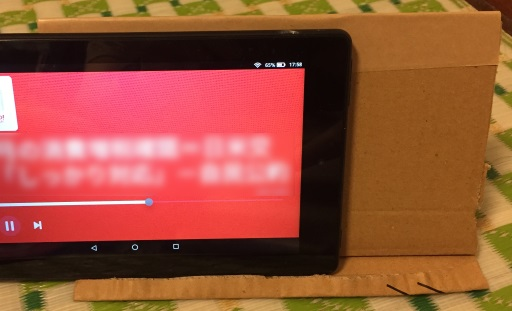
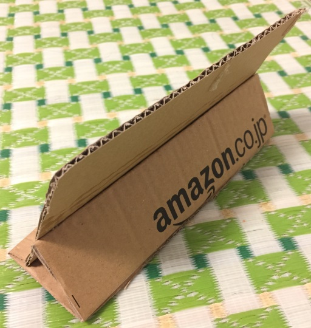
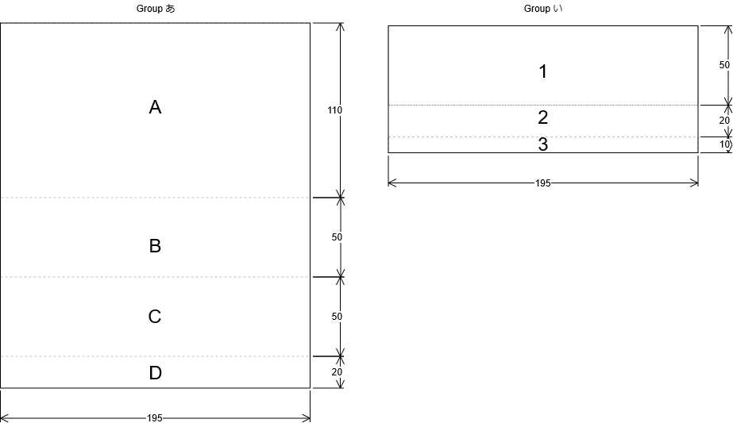

# Cardboard stand for 7 inch tablet

This is a cardboard stand for 7 inch tablets such as Amazon Fire 7.

## Demo

## Prepare

1. Cardboard

2. Cutter or scissors

3. Clothespin

4. Glue

5. Gum tape or wrapping tape.

## Build

1. Cut off "Groupあ" and "Groupい" from the cardboard with a cutter or scissors.

2. Use a cutter to lightly streak the bending point.

3. Bend A to D of "Groupあ" and glue D to A.

4. Bend 2 and 3 of "Groupい", glue 3 to 2 and fix with a washer until it is glued.

5. Glue B of "Groupあ" and 1 of "Groupい".

6. Reinforce the end with gum tape or wrapping tape.

7. Completed.

## Usage

Put the tablet on 2 of "Group i".

## Contribution

1. Fork it ( http://github.com/hiroshikuze/cardboard-stand-for-7-inch-tablet/fork )
2. Create your feature branch (git checkout -b my-new-feature)
3. Commit your changes (git commit -am 'Add some feature')
4. Push to the branch (git push origin my-new-feature)
5. Create new Pull Request

## LICENCE

MIT License.

## Author

[hiroshikuze](https://github.com/hiroshikuze)

## Donation

[Author's wish list by Amazon(Japanese)](https://www.amazon.jp/hz/wishlist/ls/5BAWD0LZ89V9?ref_=wl_share)

